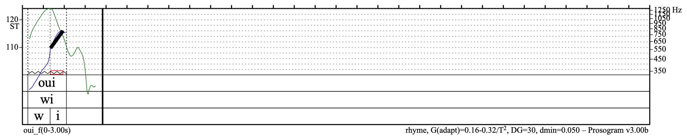
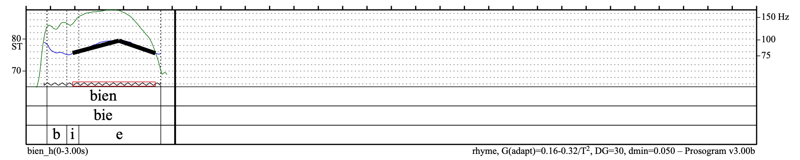

# Motivation

This is a prelminary exploration of the acceptable amount of variation for features in French intonation. In French, the last syllable of each intonation group can have either a rising (montée) or falling (descente) intonation. Montées and descentes are usually describe qualitatively. I am interested in describing them more quantitatively, in terms of semitones.

As a starting point, this document describes some tests on single syllable words that can stand alone as a natural utterance. It first analyzes the average, minimum, and maximum change for montées and descentes in the test corpus. It then describes some preliminary tests where select recordings from the corpus are resynthesized with different f0 curves, in order to explore the perceptual boundaries of prosodic categories.

In terms of prosodic categories, montée and descente can be further decomposed into several different types of expressions. For example, a simple declarative answer, an exclamation, an insistent plea, and an irritated cry all have descending f0 curves. Using resynthesized stimuli, it is possible to test whether and at what point modifying the amount of rise or fall in the f0 changes the expression of a phrase.

The explorations in thid document are intended as a first step toward a more formal perceptive study, where resynthesized stimuli will be presented to native speakers. One goal is to determine the types of f0 modificiations the most worthwhich to further explore, in other words, to generate hypotheses for further testing. Another is to establish an efficient pipeline to analyze, resynthesize, and organize stmuli for future tests.

# Summary of Results

For strictly increasing or decreasing f0 trajectories: (These are likely also dependent on the duration of the syllable.)

* Threshold of perception for a descente is around 1ST.
* Threshold of perception for a montée is around 1.5 or 2ST. In order to sound like a question, there needs to be even more movement.
* The maximum for a montée and for descente is more limited by the range of the speaking voice than by a limit on the size of the montée or descente.

Results for curves involving a bend are more interesting. The size and location of the bend is important for different types of expressive intonation. 

* For a descente with an initial montée: 
    * Elminating the initial montée removes some "enthusiasm" in the utterance
    * Changing where the bend is alters whether it is perceived as a descente or montée
* For a montée with an initial descente:
    * Elminating the initial initial montée 
    * Exaggerating the movement in the initial segment can make the utterance sound more annoyed

Even though the categories of montée and descente are quite broad and forgiving, changing how the trajectory is executed alters the perceived expression of the utterance. Having more precise measures on the effects of these changes can potentially help non-native speakers improve their accents.
    
# Corpus

21 audio files for 9 different words have been extracted from the DUPALF rechauffement recording. Each word is spoken by at least two speakers. I annotated them in Praat and ran them through Prosogram to get a stylization of the pitch curve into linear segments. The stylization is based on a perceptive model developed by d'Alessandro & Mertens and removes unimporotant microprosodic details of the f0 curve.

Below is a summary of the analyzed files. **(resynth)** indicates that the stimuli is used in the resynthesis tests described in this document.

<div style="width:50%">
| WORD | FEMALE | MALE | CHILD |
|------|--------|------|---------|
| **Bien** | Descente | Descente **(resynth)** | Déscente |
| **Bref**  | Descente  | Descente  |  NA  |
| **Cherche**  |  Montée* | Descente  | No change  |
| **Flûte**  | Descente |  Descente **(resynth)** |  NA |
| **Mince**  | Descente | Descente  | NA  |
| **Non**  | NA  | Montée **(resynth)** | Descente  |
| **Oui**  | Montée **(resynth)** | Montée **(resynth)** |  Déscente** |
| **Si**  | Descente  |  Montée **(resynth)** | NA  |
| **Zut**  | No change  |  Descente | NA |

*Sounded like a descente to me at first because of final ʃ<br>
**Very slight <br>

Recordings for 18 additional words have also been extracted. Each is spoken by at least 2 different speakers. However, the recordings have not yet been annotated. They are available for further perceptive studies.

<!--
| **aïe** | déscente | déscente| NA  |
| **bon** | déscente | déscente | NA |
| **chut** | déscente | déscente | déscente |
| **elle** | montée | montée | NA |
| **là** | déscente | déscente (flat) | déscente  |
| **lui** | montée | montée | montée |
| **moi** | montée | montée | montée |
| **où** | montée | montée (?) | montée |
| **prends** | déscente | montée (?) | ? |
| **quand** | montée | montée | montée |
| **qui** | montée | montée | montée |
| **quoi** | montée | montée (?) | NA |
| **rien** | déscente | déscente (?) | NA |
| **stop** | déscente | déscente | NA |
| **tiens** | déscente | déscente | déscente |
| **toi** | montée | montée | NA |
| **tout** | déscente | déscente (?) | déscente |
| **viens** | déscente | déscente | déscente |
-->
</div>

# General Analysis

Summary of frequency change for different types of contours in the corpus. In general, montées have bigger deltas than descentes. Descente with an initial montée have bigger deltas than the simple descente.
```{r , message=TRUE, warning=FALSE, echo=TRUE}
library("tidyverse")
library("stringr")
library("kableExtra")

my_path <- "../data/prosogram-results/syllab1/data/"
recordings <- c("bien_e", "bien_f", "bien_h", "bref_f", "bref_h", 
                "cherche_e", "cherche_f", "cherche_h", "flute_f", "flute_h", 
                "mince_f", "mince_h", "non_e", "non_h", "oui_e", "oui_f", "oui_h",
                "si_f", "si_h", "zut_f", "zut_h")

# Load one Prosogram data file
load_one_prosogram_data <- function(name, path) {
  read_tsv(str_c(path, name, "_data.txt")) %>%
    # speaker saves the part after _ in the phrase filename, either h, f, or e
    mutate(phrase=str_split(name, pattern="_")[[1]][1], speaker=str_split(name, pattern="_")[[1]][2]) %>%
    select(phrase, speaker, intrasyllab, intersyllab, up, down)
}
  
# Load Prosogram Data into a tibble
results <- lapply(recordings, load_one_prosogram_data, path=my_path) %>% reduce(bind_rows)

# Find all phrases with pure montées (f0 curve only going up)
montees <- results %>% filter(intrasyllab > 0, down == 0)

# Find all phrases with pure descentes (f0 curve only going down)
descentes <- results %>% filter(intrasyllab < 0, up == 0)

# Descentes with initial montée
descentes_complex <- results %>% filter(intrasyllab < 0, up != 0)

# Montées with some descente
montees_complex <- results %>% filter(intrasyllab > 0, down != 0)

# Summary of change
summary<-tribble(
  ~Contour, ~Min_delta, ~Max_delta, ~Mean_delta,
  "Simple montée", min(montees$intrasyllab), max(montees$intrasyllab), mean(montees$intrasyllab),
  "Simple descente", max(descentes$intrasyllab), min(descentes$intrasyllab), mean(descentes$intrasyllab),
  "Montée (w/initial descente)", min(montees_complex$up), max(montees_complex$up), mean(montees_complex$up),
  "Descente (w/initial montée)", max(descentes_complex$down), min(descentes_complex$down), mean(descentes_complex$down),
)

knitr::kable(summary) %>%
  kable_styling(position = "left", full_width = F)
```

# Resynthesis

```{r, message=FALSE, warning=FALSE}
library("rPraat")
source("../utils/hertzToST.R")

# Some functions to modify pitchtiers

# pt is pitchtier object. n is the index of the point we want to changeg
# sets f[n] to be f[m] + s semtiones. m is automatically set to n-1 if it is not supplied
set_interval <- function(pt, s, n, m=NULL) {
  if (is.null(m)) { m <- n-1 }
  ref_pitch <- pt$f[m]
  new_pitch <- semitones_to_hertz(s, ref_pitch)
  
  pt$f[n] <- new_pitch
  return(pt)
}

# pt is pitchtier object. target_index is the index of the point we want to changeg
# sets f[n] to be (f[n] - f[m]) + s semitones, i.e. exising difference plus s semitones.
# m is automatically set to n-1 if it is not supplied
modify_interval <- function(pt, s, n, m=NULL) {
  if (is.null(m)) { m <- n-1 }
  ref_pitch <- pt$f[m]
  old_interval <- hertz_to_semitones(pt$f[n], ref_pitch)
  new_interval <- old_interval + s
  new_pitch <- semitones_to_hertz(new_interval, ref_pitch)
  pt$f[n] <- new_pitch
  return(pt)
}

# Write in format for Grégoire's reprosody script
# name is base file name. tag is some descriptive info.
write_resynthesis_file <- function(my_pt, path, name, tag) {
   # Pitchtier just for viewing  
   filename_output <- str_c(path, "pitchtier_modified/", name, "_", tag, ".PitchTier")
   pt.write(my_pt, filename_output)  
   
   # For Voks
   filename_output <- str_c(path, "for_voks/", name, "_", tag, ".txt")
   ptdata <- data.frame(my_pt$t, my_pt$f)
   write.table(round(ptdata, 4), filename_output, sep=" ", col.names=FALSE, row.names=FALSE)
}

```

## Simple Descente

### Exaggeration

To push the limits of the descente, I took the stimuli with the biggest descending interval and tried to increase it even further.

Original file: 3.2ST descente:
<br>
<html><audio controls>
<source src="../data/prosogram-results/syllab1/audio/flute_h.mp3" type="audio/mp3">
</audio></html>


```{r, message=FALSE, warning=FALSE}
# Load Pitchtier
my_path <- "../data/prosogram-results/syllab1/"
name <- "flute_h"

filename <- str_c(my_path,"pitchtier/",name, "_styl.PitchTier")
mpt <- pt.read(filename)

deltas <- seq(16, 24, by=2)

# Move the first point (mpt$t[1]) even higher by increments in deltas
lapply(deltas, function(elt) {
  write_resynthesis_file(modify_interval(mpt, elt, 1, 2), my_path, name, str_c("plus", elt, "t1"))
})

# Move the second point (mpt$t[2]) even lower by increments in deltas
lapply(deltas, function(elt) {
  write_resynthesis_file(modify_interval(mpt, -elt, 2, 1), my_path, name, str_c("minus", elt, "t2"))
})
```
Some results:
<br>
1-Start up 2ST: <html><audio controls>
<source src="../data/prosogram-results/syllab1/reprosody_output/flute_h_plus2t1.mp3" type="audio/mp3">
</audio></html>
2-End down 2ST: <html><audio controls>
<source src="../data/prosogram-results/syllab1/reprosody_output/flute_h_minus2t2.mp3" type="audio/mp3">
</audio></html>
<br>
3-Start up 6ST: <html><audio controls>
<source src="../data/prosogram-results/syllab1/reprosody_output/flute_h_plus6t1.mp3" type="audio/mp3">
</audio></html>
4-End down 6ST: <html><audio controls>
<source src="../data/prosogram-results/syllab1/reprosody_output/flute_h_minus6t2.mp3" type="audio/mp3">
</audio></html>
<br>
5-Start up 14ST: <html><audio controls>
<source src="../data/prosogram-results/syllab1/reprosody_output/flute_h_plus14t1.mp3" type="audio/mp3">
</audio></html>
6-End down 14ST: <html><audio controls>
<source src="../data/prosogram-results/syllab1/reprosody_output/flute_h_minus14t2.mp3" type="audio/mp3">
</audio></html>
<br>
7-Start up 24ST: <html><audio controls>
<source src="../data/prosogram-results/syllab1/reprosody_output/flute_h_plus24t1.mp3" type="audio/mp3">
</audio></html>
8-End down 24ST: <html><audio controls>
<source src="../data/prosogram-results/syllab1/reprosody_output/flute_h_minus24t2.mp3" type="audio/mp3">
</audio></html>
<br>

To my ears, 7 sounds the most unnatural, but it's mostly because of how high the man's voice goes. In general, the size of a single syllable descente is quite forgiving toward bigger intervals. This could be the type of stimuli, as an exclamation, which tend to have a large span.

### Neutralization

Let's go in the opposite direction. What is the minimum amount of f0 change for the stimli to still get perceived as an exclamation?

```{r, message=FALSE, warning=FALSE}
# Still the same file
my_path <- "../data/prosogram-results/syllab1/"
name <- "flute_h"

filename <- str_c(my_path,"pitchtier/",name, "_styl.PitchTier")
mpt <- pt.read(filename)

deltas <- seq(0, 1.5, by=0.25)

# this time we set the interval, changing f[1]
lapply(deltas, function(elt) {
  write_resynthesis_file(set_interval(mpt, elt, 1, 2), my_path, name, str_c("smaller", elt, "t1"))
})

```

To my ears, when we get below 1 semitone change, it starts to sound less like an exclamation. 

<br>
1 semitone descente: <html><audio controls>
<source src="../data/prosogram-results/syllab1/reprosody_output/flute_h_smaller1t1.mp3" type="audio/mp3">
</audio></html>
<br>
0.75 semitones descente: <html><audio controls>
<source src="../data/prosogram-results/syllab1/reprosody_output/flute_h_smaller0.75t1.mp3" type="audio/mp3">
</audio></html>
<br>
0.5 semitones descente: <html><audio controls>
<source src="../data/prosogram-results/syllab1/reprosody_output/flute_h_smaller0.5t1.mp3" type="audio/mp3">
</audio></html>
<br>
0.25 semitones descente: <html><audio controls>
<source src="../data/prosogram-results/syllab1/reprosody_output/flute_h_smaller0.25t1.mp3" type="audio/mp3">
</audio></html>
<br>
0 semitones descente: <html><audio controls>
<source src="../data/prosogram-results/syllab1/reprosody_output/flute_h_smaller0t1.mp3" type="audio/mp3">
</audio></html>
<br>

## Simple Montée

### Exaggeration

Original file: 6.27ST montée:
<br>
<html><audio controls>
<source src="../data/prosogram-results/syllab1/audio/oui_h.mp3" type="audio/mp3">
</audio></html>


```{r, message=FALSE, warning=FALSE}
# Load Pitchtier
my_path <- "../data/prosogram-results/syllab1/"
name <- "oui_h"

filename <- str_c(my_path,"pitchtier/",name, "_styl.PitchTier")
mpt <- pt.read(filename)

# Amounts to change by
deltas <- seq(2, 24, by=2)

# Move the last point (mpt$t[4]) even lower by increments in deltas
lapply(deltas, function(elt) {
  write_resynthesis_file(modify_interval(mpt, elt, 4), my_path, name, str_c("higher", elt, "t4"))
})

```

<br>
End up 2ST: <html><audio controls>
<source src="../data/prosogram-results/syllab1/reprosody_output/oui_h_higher2t4.mp3" type="audio/mp3">
</audio></html>
<br>
End up 6ST: <html><audio controls>
<source src="../data/prosogram-results/syllab1/reprosody_output/oui_h_higher6t4.mp3" type="audio/mp3">
</audio></html>
<br>
End up 12ST: <html><audio controls>
<source src="../data/prosogram-results/syllab1/reprosody_output/oui_h_higher12t4.mp3" type="audio/mp3">
</audio></html>
<br>
End up 14ST: <html><audio controls>
<source src="../data/prosogram-results/syllab1/reprosody_output/oui_h_higher14t4.mp3" type="audio/mp3">
</audio></html>
<br>
To my ears, up to 12ST beyond the original 6.27ST change (18.27 ST total) sound plausible. Once we get to +14ST, it starts to sound too much. Even montées of 18ST are unlikely in real life due to limits of the voice. This shows that the amount of montée once beyond a certain point is quite flexible.

### Neutralization

```{r, message=FALSE, warning=FALSE}
# Load Pitchtier
my_path <- "../data/prosogram-results/syllab1/"
name <- "oui_h"

filename <- str_c(my_path,"pitchtier/",name, "_styl.PitchTier")
mpt <- pt.read(filename)

# Amounts to change by
deltas <- seq(0, 6, by=2)
lapply(deltas, function(elt) {
  write_resynthesis_file(set_interval(mpt, elt, 4), my_path, name, str_c("smaller", elt, "t4"))
})
```

<br>
0ST up in last segment: <html><audio controls>
<source src="../data/prosogram-results/syllab1/reprosody_output/oui_h_smaller0t4.mp3" type="audio/mp3">
</audio></html>
<br>
2ST up in last segment: <html><audio controls>
<source src="../data/prosogram-results/syllab1/reprosody_output/oui_h_smaller2t4.mp3" type="audio/mp3">
</audio></html>
<br>
4ST up in last segment: <html><audio controls>
<source src="../data/prosogram-results/syllab1/reprosody_output/oui_h_smaller4t4.mp3" type="audio/mp3">
</audio></html>
<br>

We can still hear a bit of a montée because this pronunciation has a non-linear montée curve. I am only changing the amount of montée in the last segment, but there is still 1.73 ST montée in the first two segments.

Looking at a different file, this one rises in a single linear segment.

Original file: 12.6ST montée:
<br>
<html><audio controls>
<source src="../data/prosogram-results/syllab1/audio/oui_f.mp3" type="audio/mp3">
</audio></html>



```{r, message=FALSE, warning=FALSE}
# Load Pitchtier
my_path <- "../data/prosogram-results/syllab1/"
name <- "oui_f"

filename <- str_c(my_path,"pitchtier/",name, "_styl.PitchTier")
mpt <- pt.read(filename)

# Amounts to change by
deltas <- seq(0, 2, by=0.5)
lapply(deltas, function(elt) {
  write_resynthesis_file(set_interval(mpt, elt, 2), my_path, name, str_c("smaller", elt, "t4"))
})
```

<br>
2ST montée: <html><audio controls>
<source src="../data/prosogram-results/syllab1/reprosody_output/oui_f_smaller2t4.mp3" type="audio/mp3">
</audio></html>
<br>
1.5ST montée: <html><audio controls>
<source src="../data/prosogram-results/syllab1/reprosody_output/oui_f_smaller1.5t4.mp3" type="audio/mp3">
</audio></html>
<br>
1ST montée: <html><audio controls>
<source src="../data/prosogram-results/syllab1/reprosody_output/oui_f_smaller1t4.mp3" type="audio/mp3">
</audio></html>
<br>

These ones have a montée but they sound less like a question. It's more like someone saying "Yes, but..." which is known as a continuation. Or someone answering the phone after being woken up from sleep in the middle of the night.

## Descente With Initial Montée

Here's an example of a stimuli that sounds like a descente, but its f0 curve has a montée in the beginning that is almost as large as the descente.

Original file: 3.84ST initial montée, 3.92ST descente
<br>
<html><audio controls>
<source src="../data/prosogram-results/syllab1/audio/bien_h.mp3" type="audio/mp3">
</audio></html>



I'm interested in what it sound like when

* The initial montée is neutralized
* The initial montée is exaggerated 

### Neutralize Initial Segment

#### Flatten Initial Segment

First, let's keep the two-segment f0 contour and make the first part of the contour flat instead of rising. The descente part of the contour remains unchangegd.

```{r, message=FALSE, warning=FALSE}
# Load Pitchtier
my_path <- "../data/prosogram-results/syllab1/"
name <- "bien_h"

filename <- str_c(my_path,"pitchtier/",name, "_styl.PitchTier")
mpt <- pt.read(filename)

write_resynthesis_file(set_interval(mpt, 0, 1, 2), my_path, name, str_c("no-initial-rise"))
```

Result: <html><audio controls>
<source src="../data/prosogram-results/syllab1/reprosody_output/bien_h_no-initial-rise.mp3" type="audio/mp3">
</audio></html>
<br>

To me, this sound like the person is less enthusiastic than the original, but the difference is pretty subtle. 

#### Eliminate Initial Segment

We can also try to make the stimuli strictly descending, by getting rid of the bend in the contour.

```{r, message=FALSE, warning=FALSE}
# Load Pitchtier
my_path <- "../data/prosogram-results/syllab1/"
name <- "bien_h"

filename <- str_c(my_path,"pitchtier/",name, "_styl.PitchTier")
mpt <- pt.read(filename)

mpt_new <- mpt
mpt_new$f[1] <- mpt$f[2]
mpt_new$f[2] <- mpt$f[3]
mpt_new$t[2] <- mpt$t[3]
mpt_new$f <- head(mpt_new$f,-1)
mpt_new$t <- head(mpt_new$t,-1)

write_resynthesis_file(mpt_new, my_path, name, str_c("fall"))
```

Result: <html><audio controls>
<source src="../data/prosogram-results/syllab1/reprosody_output/bien_h_fall.mp3" type="audio/mp3">
</audio></html>
<br>
This also sound less enthusiastic than the original. Also a subtle difference.

### Exaggerate Initial Segment

#### Increase Size of Initial Segment

We can move the initial point of the f0 curve lower. Recall that we already have 3.84ST montée in the beginning.

```{r, message=FALSE, warning=FALSE}
# Load Pitchtier
my_path <- "../data/prosogram-results/syllab1/"
name <- "bien_h"

filename <- str_c(my_path,"pitchtier/",name, "_styl.PitchTier")
mpt <- pt.read(filename)

# Amounts to change by
deltas <- seq(2, 16, by=2)
lapply(deltas, function(elt) {
  write_resynthesis_file(modify_interval(mpt, -elt, 1, 2), my_path, name, str_c("bigger-montee", elt))
})
```

<br>
3.84ST + 2ST montée: <html><audio controls>
<source src="../data/prosogram-results/syllab1/reprosody_output/bien_h_bigger-montee2.mp3" type="audio/mp3">
</audio></html>
<br>
3.84ST + 6ST montée: <html><audio controls>
<source src="../data/prosogram-results/syllab1/reprosody_output/bien_h_bigger-montee6.mp3" type="audio/mp3">
</audio></html>
<br>
3.84ST + 14ST montée: <html><audio controls>
<source src="../data/prosogram-results/syllab1/reprosody_output/bien_h_bigger-montee14.mp3" type="audio/mp3">
</audio></html>
<br>

It starts to sound unnatural when the voice starts that low, but the expression doesn't drastically change.

#### Increase Duration of Initial Segment

From 0 to 1 of syllable nucleus, where does the descent start?
```{r, echo=TRUE}
my_path <- "../data/prosogram-results/syllab1/"
name <- "bien_h"

filename <- str_c(my_path,"pitchtier/",name, "_styl.PitchTier")
mpt <- pt.read(filename)

(mpt$t[2]-mpt$t[1])/(mpt$t[3]-mpt$t[1])
```

Let's move the beginning of the descente half way between where it currently is and the end of the syllable nucleus.
```{r, message=FALSE, warning=FALSE}
# Load Pitchtier
my_path <- "../data/prosogram-results/syllab1/"
name <- "bien_h"

filename <- str_c(my_path,"pitchtier/",name, "_styl.PitchTier")
mpt <- pt.read(filename)

mpt_new <- mpt
mpt_new$t[2] <- mpt$t[2] + (mpt$t[3] - mpt$t[2])/2

write_resynthesis_file(mpt_new, my_path, name, str_c("later-fall1"))
```
The result no longer sounds like a desente and instead sounds like a montée!

<html><audio controls>
<source src="../data/prosogram-results/syllab1/reprosody_output/bien_h_later-fall1.mp3" type="audio/mp3">
</audio></html>
<br>

## Montée with Initial Descente

Below is an example of a stimuli that sounds like a montée, but its f0 curve has a descente in the beginning that's almost as large as the montée.

Original file: 2.2ST initial descente, 4.28ST montée
<br>
<html><audio controls>
<source src="../data/prosogram-results/syllab1/audio/non_h.mp3" type="audio/mp3">
</audio></html>


### Neutralize Initial Segment
#### Flatten Initial Segment

I don't think that flattening the initial descente will significantly change the expression of the output stimuli. Below is another word pronounced by the same speaker with a similar sounding expression that has a flat f0 segment followed by a montée.

<br>
<html><audio controls>
<source src="../data/prosogram-results/syllab1/audio/si_h.mp3" type="audio/mp3">
</audio></html>


#### Eliminate Initial Segment

```{r, message=FALSE, warning=FALSE}
# Load Pitchtier
my_path <- "../data/prosogram-results/syllab1/"
name <- "non_h"

filename <- str_c(my_path,"pitchtier/",name, "_styl.PitchTier")
mpt <- pt.read(filename)

mpt_new <- mpt
mpt_new$f[1] <- mpt$f[2]
mpt_new$f[2] <- mpt$f[3]
mpt_new$t[2] <- mpt$t[3]
mpt_new$f <- head(mpt_new$f,-1)
mpt_new$t <- head(mpt_new$t,-1)

write_resynthesis_file(mpt_new, my_path, name, str_c("rise"))
```
The result still sound like a question but less contradictory than the initial stimuli.

<html><audio controls>
<source src="../data/prosogram-results/syllab1/reprosody_output/non_h_rise.mp3" type="audio/mp3">
</audio></html>
<br>

### Exaggerate Initial Segment
#### Increase Sizeof Initial Segment
The stimuli already has 2.2ST descente at the beginning. What happens when we increase this amount? We can do so by raising the f0 at the starting point of the stimuli.

```{r, message=FALSE, warning=FALSE}
# Load Pitchtier
my_path <- "../data/prosogram-results/syllab1/"
name <- "non_h"

filename <- str_c(my_path,"pitchtier/",name, "_styl.PitchTier")
mpt <- pt.read(filename)

# Amounts to change by
deltas <- seq(2, 16, by=2)
lapply(deltas, function(elt) {
  write_resynthesis_file(modify_interval(mpt, elt, 1, 2), my_path, name, str_c("bigger-descente", elt))
})

```

A similar expression as the original stimuli:
<br>
2.2ST + 2ST descente: <html><audio controls>
<source src="../data/prosogram-results/syllab1/reprosody_output/non_h_bigger-descente2.mp3" type="audio/mp3">
</audio></html>
<br>

Starts to sound ambiguous
<br>
2.2ST + 4ST descente: <html><audio controls>
<source src="../data/prosogram-results/syllab1/reprosody_output/non_h_bigger-descente4.mp3" type="audio/mp3">
</audio></html>
<br>

More than 6ST increase in descente makes the entire phrase sound like a statement rather than question.
<br>
2.2ST + 6ST descente: <html><audio controls>
<source src="../data/prosogram-results/syllab1/reprosody_output/non_h_bigger-descente6.mp3" type="audio/mp3">
</audio></html>
<br>
2.2ST + 8ST descente: <html><audio controls>
<source src="../data/prosogram-results/syllab1/reprosody_output/non_h_bigger-descente8.mp3" type="audio/mp3">
</audio></html>
<br>

A large initial descente followed by a small montée sounds like the speaker is annoyed.
<br>
2.2ST + 12ST descente: <html><audio controls>
<source src="../data/prosogram-results/syllab1/reprosody_output/non_h_bigger-descente12.mp3" type="audio/mp3">
</audio></html>
<br>

#### Increase Duration of Initial Segment

From 0 to 1 of syllable nucleus, where does the montée start?
```{r, echo=TRUE}
# Load Pitchtier
my_path <- "../data/prosogram-results/syllab1/"
name <- "non_h"
filename <- str_c(my_path,"pitchtier/",name, "_styl.PitchTier")
mpt <- pt.read(filename)
(mpt$t[2]-mpt$t[1])/(mpt$t[3]-mpt$t[1])
```

It's already about 2/3 of the way through syllable nucleus. Let's try a few more timings.

```{r, message=FALSE, warning=FALSE}
# Load Pitchtier
my_path <- "../data/prosogram-results/syllab1/"
name <- "non_h"

filename <- str_c(my_path,"pitchtier/",name, "_styl.PitchTier")
mpt <- pt.read(filename)

# Inflection point at 50% of syllable nucleus
mpt_new <- mpt
mpt_new$t[2] <-  mpt$t[1] + (mpt$t[3] - mpt$t[1])*0.5
write_resynthesis_file(mpt_new, my_path, name, str_c("later-rise50"))

# Inflection point at 80% of syllable nucleus
mpt_new <- mpt
mpt_new$t[2] <- mpt$t[1]+ (mpt$t[3] - mpt$t[1])*0.80
write_resynthesis_file(mpt_new, my_path, name, str_c("later-rise80"))

# Inflection point at 90% of syllable nucleus
mpt_new <- mpt
mpt_new$t[2] <- mpt$t[1] + (mpt$t[3] - mpt$t[1])*0.9
write_resynthesis_file(mpt_new, my_path, name, str_c("later-rise90"))

# Inflection point at 95% of syllable nucleus
mpt_new <- mpt
mpt_new$t[2] <- mpt$t[1] + (mpt$t[3] - mpt$t[1])*0.95
write_resynthesis_file(mpt_new, my_path, name, str_c("later-rise95"))
```

As a control, I moved the inflection point to 50% of the syllable nucleus, reducing instead of increasing the length of the initial descente. The result doesn't sound so different from the original stimuli.
<br>
Inflection point at 50% of syllable nucleus: <html><audio controls>
<source src="../data/prosogram-results/syllab1/reprosody_output/non_h_later-rise50.mp3" type="audio/mp3">
</audio></html>
<br>
<br>
The following synthesized stimuli increase the length of the initial descente. These sound very ambiguous to me. Even when the inflection point at is 95%, it still does not fully sound like a descente.
<br>
Inflection point at 80% of syllable nucleus: <html><audio controls>
<source src="../data/prosogram-results/syllab1/reprosody_output/non_h_later-rise80.mp3" type="audio/mp3">
</audio></html>
<br>
Inflection point at 90% of syllable nucleus: <html><audio controls>
<source src="../data/prosogram-results/syllab1/reprosody_output/non_h_later-rise90.mp3" type="audio/mp3">
</audio></html>
<br>
Inflection point at 95% of syllable nucleus: <html><audio controls>
<source src="../data/prosogram-results/syllab1/reprosody_output/non_h_later-rise95.mp3" type="audio/mp3">
</audio></html>
<br>
